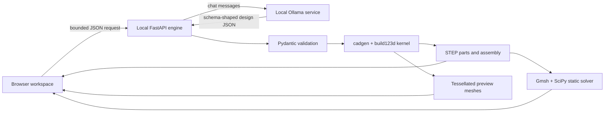

# Architecture

## Components

The browser app is a Vinext/React client. `app/page.tsx` owns the workspace state and `app/viewer.tsx` renders tessellated solids with Three.js. `lib/design.ts` contains shared browser types and the local engine client.

The Python engine is deliberately separate because Open CASCADE and Gmsh need a native runtime and more memory than the hosted browser surface. `engine/server.py` exposes the bounded HTTP interface. `engine/schema.py` rejects extra fields, malformed assembly graphs, invalid limits, excessive design size, and unsupported primitives. `engine/kernel.py` converts the declarative model into B-rep solids and STEP. `engine/simulate.py` performs the limited finite-element solve.

## Trust boundaries

AI output crosses an untrusted boundary. It is treated as data and must pass the strict Pydantic schema. The engine never executes Python supplied by the model. CAD construction uses a fixed set of operations and primitives.

Browser input crosses a separate boundary. Request length, part count, feature count, numeric range, identifiers, job count, paths, and filenames are bounded. The engine listens on loopback by default and checks browser origins. An optional engine token protects a separately hosted instance.

## Design lifecycle

Each generation or rebuild creates an opaque job ID and a directory below `work/designs/`. The directory contains the validated design specification, STEP artifacts, tessellated result data, and optional simulation output. The browser polls job status. It does not receive a success result until geometry construction and solid checks finish.

Edits create a draft design in the browser. The UI marks it as unbuilt and disables STEP export and simulation. A rebuild creates a new immutable job/result. Project JSON files contain the declarative design and conversation summary; opening one always rebuilds the CAD instead of trusting embedded geometry.

## Deployment model

The browser interface can be deployed independently, but prompt-to-CAD and simulation require an HTTPS-accessible engine or the local loopback engine. Browser mixed-content rules prevent a public HTTPS interface from calling an arbitrary insecure remote engine. The personal alpha is therefore best run entirely on localhost.

The current engine keeps jobs in process memory and artifacts on local disk. A production service needs authenticated users, persistent job metadata, object storage, quotas, cancellation, rate limits, isolated workers, observability, cleanup, and a license review for all distributed native dependencies.
